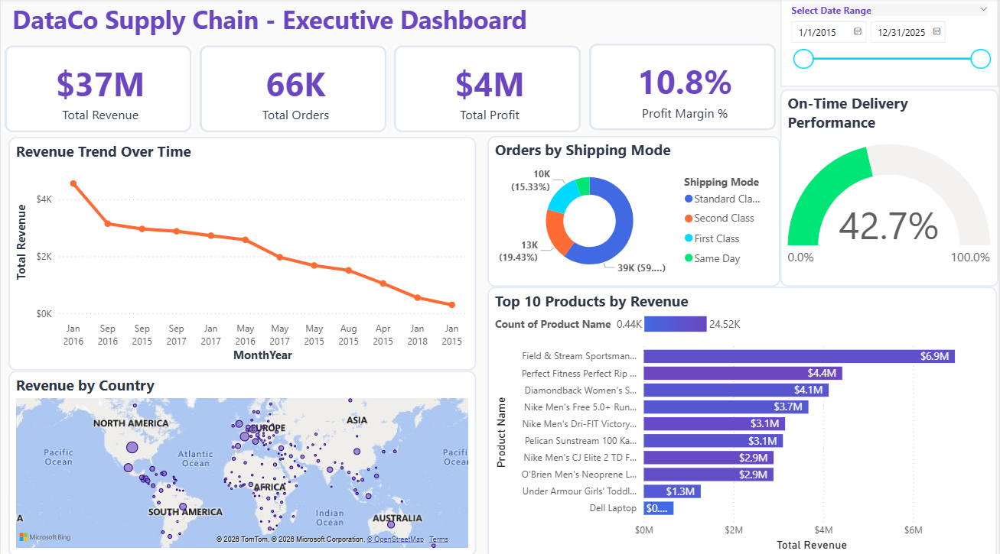
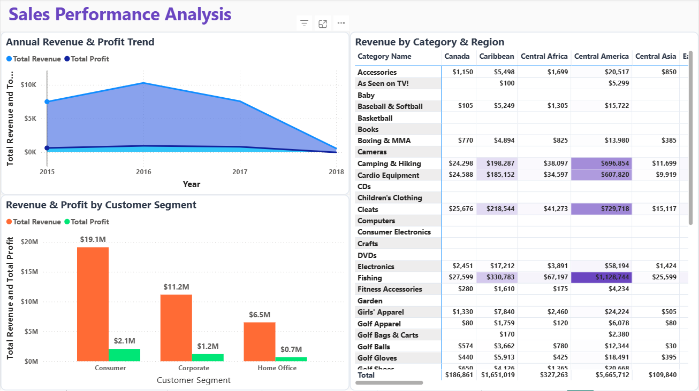

# 📊 DataCo Supply Chain Analytics Dashboard


An advanced Power BI analytics project analyzing **180,520+ supply chain transactions** to uncover operational inefficiencies, revenue trends, and customer behavior patterns.

---

## 📁 Project Overview

This business intelligence dashboard provides comprehensive insights into supply chain operations:

- **Financial Performance**: $37M revenue analysis with profitability tracking
- **Operational Metrics**: Delivery performance and logistics optimization
- **Customer Intelligence**: Segmentation and behavior analysis (20K+ customers)
- **Product Analytics**: Category performance and margin analysis

**Key Insight**: Identified critical on-time delivery gap (42.7% vs 95% target) representing major operational improvement opportunity.

---

## 🎯 Dashboards

### 1. Executive Dashboard
High-level KPIs for executive decision-making
- Revenue ($37M), Orders (66K), Profit ($4M), and Margin (10.8%) KPI cards
- Revenue trend analysis
- Top 10 products by revenue
- Geographic distribution mapping
- Delivery performance gauge

### 2. Sales Performance Analysis
Revenue patterns and trends analysis
- Revenue by category & region heat map
- Customer segment performance comparison
- Annual revenue and profit trends

### 3. Supply Chain Operations
Logistics and delivery performance monitoring
- On-time delivery analysis by shipping mode
- Regional delivery performance with benchmarks
- Late delivery root cause analysis (Cleats category highest)

### 4. Customer Intelligence
Customer segmentation and value analysis
- Customer distribution (Consumer 52%, Corporate 30%, Home Office 18%)
- Top 10 customers by revenue
- Repeat purchase rate: 57%
- Average customer value: $2,000

### 5. Product Analysis
Product portfolio performance evaluation
- Top 10 categories by revenue (Fishing leads)
- Profit margin analysis (Golf Bags & Carts: 17.5% highest)
- Revenue vs profit analysis
- Category trend tracking

---

## 📊 Key Findings

| Metric | Value | Insight |
|--------|-------|---------|
| Total Revenue | $37M | Declining trend from 2016 peak |
| Profit Margin | 10.8% | Opportunity for improvement |
| On-Time Delivery | 42.7% | **Critical issue** - 52.3 points below target |
| Repeat Purchase Rate | 57% | Strong loyalty despite operational issues |
| Total Customers | 20,652 | Consistent $2K average value |
| Top Category | Fishing | Highest revenue generator |
| Most Profitable | Golf Bags & Carts | 17.5% margin |

---

## 🛠️ Technical Implementation

### Data Model
- **Schema**: Star schema
- **Fact Table**: 180,520 transactions
- **Dimension**: Calendar table with hierarchies
- **Relationships**: One-to-many

### DAX Measures (15+)
```dax
// Financial
Total Revenue = SUM(DataCoSupplyChainDataset[Sales])
Profit Margin % = DIVIDE([Total Profit], [Total Revenue], 0)

// Operations
On Time Delivery % = DIVIDE([On Time Deliveries], COUNTROWS(...), 0)

// Customers
Repeat Purchase Rate = DIVIDE([Repeat Customers], [Total Customers], 0)
```

### Advanced Features
- Conditional formatting with gradient heat maps
- Top N filtering
- Time intelligence calculations
- Target benchmarking
- Cross-filtering
- Professional color-coding

---

## 🎨 Design

**Color Palette:**
- Primary: Deep Purple (#6B46C1)
- Accent: Bright Cyan (#00D9FF)
- Success: Green (#00E676)
- Warning: Orange (#FF6B35)
- Alert: Red (#FF1744)

**Standards:**
- Rounded corners (10px)
- White card backgrounds
- Light gray borders
- Segoe UI typography

---

## 📂 Repository Structure
```
DataCo_PowerBI_Project/
│
├── data/
│   └── DataCo_Cleaned.xlsx
│
├── powerbi/
│   └── DataCo_Dashboard.pbix
│
├── screenshots/
│   ├── 01_Executive_Dashboard.png
│   ├── 02_Sales_Performance.png
│   ├── 03_Supply_Chain.png
│   ├── 04_Customer_Intelligence.png
│   └── 05_Product_Analysis.png
│
├── documentation/
│   └── Technical_Documentation.txt
│
├── LICENSE
└── README.md
```

---

## 🚀 Getting Started

### Prerequisites
- Microsoft Power BI Desktop (latest version)
- Microsoft Excel

### Installation

1. Clone the repository
```bash
git clone https://github.com/niharkaria/DataCo-Supply-Chain-Analytics.git
cd DataCo-Supply-Chain-Analytics
```

2. Open `powerbi/DataCo_Dashboard.pbix` in Power BI Desktop

3. Update data source path if needed:
   - Transform Data > Data Source Settings
   - Update path to DataCo_Cleaned.xlsx
   - Refresh data

4. Explore the 5 dashboard pages

---

## 📸 Dashboard Previews

### Executive Dashboard


### Sales Performance


### Supply Chain Operations


*Additional screenshots in /screenshots folder*

---

## 💡 Skills Demonstrated

**Power BI:**
- Data modeling (star schema)
- DAX formulas (15+ measures)
- Advanced visualizations
- Conditional formatting
- Interactive filtering

**Data Analysis:**
- Business intelligence
- KPI development
- Trend analysis
- Root cause analysis
- Performance benchmarking

**Business Acumen:**
- Actionable insights
- Strategic recommendations
- Executive communication
- Problem prioritization

---

## 📈 Strategic Recommendations

1. **Priority 1**: Fix delivery performance crisis (42.7% → 95%)
2. **Priority 2**: Investigate 2018 revenue decline (93% drop)
3. **Priority 3**: Optimize shipping (eliminate Second Class underperformance)
4. **Priority 4**: Focus on high-margin categories

---

## 🔧 Technologies

- Power BI Desktop
- Microsoft Excel
- DAX
- Power Query

---

## 📝 Dataset

- **Source**: DataCo Smart Supply Chain Dataset
- **Records**: 180,520 transactions
- **Period**: 2015-2018
- **Scope**: Global supply chain
- **Attributes**: 56 columns

---

## 📄 License

MIT License - see [LICENSE](LICENSE) file

---

## 👤 Author

**Nihar Karia**

- GitHub: [@niharkaria](https://github.com/niharkaria)
- LinkedIn: [Nihar Karia](https://www.linkedin.com/in/niharkaria)
- Email: niharkaria7@gmail.com

---

## 🙏 Acknowledgments

- Dataset: DataCo Smart Supply Chain Dataset
- Tools: Microsoft Power BI

---

**⭐ If you found this project helpful, please star it!**

---

*Last Updated: January 2026*
```

---